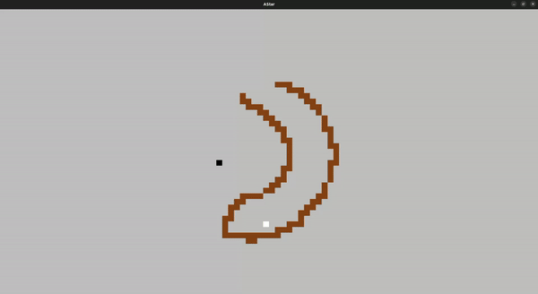
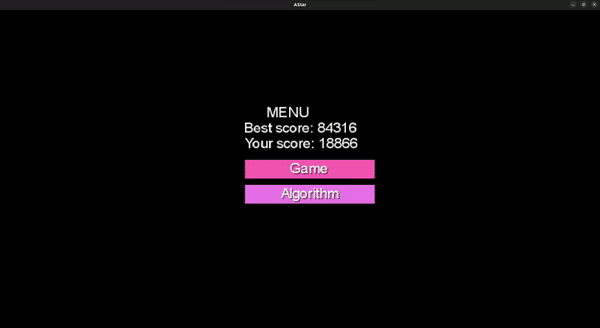

# A Star Path Finding

This project is an implementation of the A* pathfinding
algorithm with a visualizer and a game.

## Visualizer

In the visualizer a start and end point can be defined and wall drawn so that
the algorithm finds a path.

    

### Controls

| Key                   | Action                                         |
|-----------------------|------------------------------------------------|
| `mouse + click`       | create walls                                   |
| `mouse + right click` | remove walls                                   |
| `s`                   | place the begin point for the algorithm        |
| `e`                   | place the end point for the algorithm          |
| `enter/return`        | run the algorithm instantly                    |
| `space`               | run the algorithm showing steps                |
| `r`                   | erases all the walls and resets the simulation |

## Game

A little game was also implemented where you control a person been pursued by
security guards. They follow the player using the A* algorithm. The player can
also create wall to change the security guards path, but if the have no path to 
the player, all the wall are destroyed. 

    

| Key                   | Action                                         |
|-----------------------|------------------------------------------------|
| `mouse + click`       | create walls                                   |
| `mouse + right click` | remove walls                                   |
| `wasd`                | move the player                                |

## License

This work is licensed under the terms of the GPLv3.